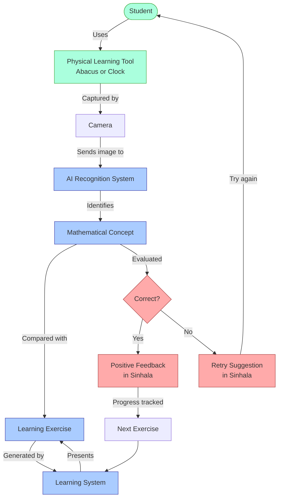

# Simplified Kinesthetic Learning System Flow

This diagram presents a streamlined overview of how the kinesthetic learning application works in practice:

## Key System Components:

1. **Physical Interaction** - Student works with tangible learning tools (abacus/clock)

2. **Image Capture** - Camera observes the student's physical manipulation

3. **AI Recognition** - System identifies what the student has done with the physical tool

4. **Learning Exercise** - System compares student's work against current exercise

5. **Feedback Loop** - Student receives immediate culturally appropriate feedback in Sinhala

6. **Adaptive Learning** - System tracks progress and adjusts exercise difficulty accordingly

This simplified flow emphasizes the core educational experience: physical interaction → digital recognition → personalized feedback → learning progression.
