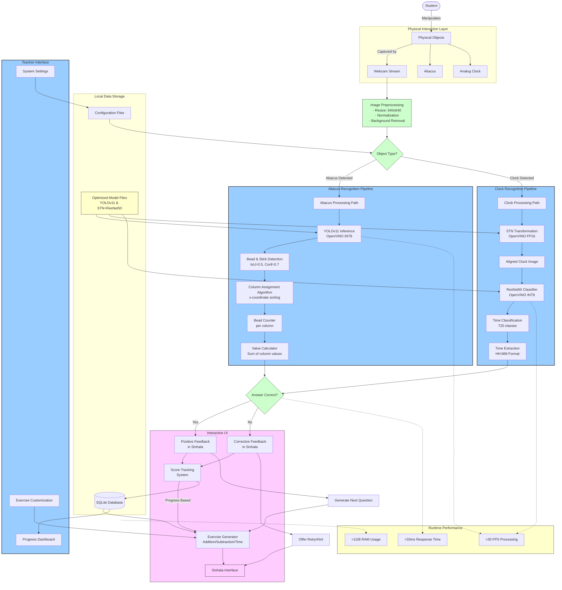

# Kinesthetic Learning System Implementation

The following diagram demonstrates how the fully implemented system processes data and interacts with users in a real classroom environment:

## Implementation Details:

1. **Data Capture & Processing Flow**

   - Student interactions are captured at 30 FPS through a standard webcam
   - Real-time image preprocessing optimizes for detection algorithms
   - Object type determination routes to appropriate processing pipeline

2. **Abacus Processing Implementation**

   - Quantized YOLOv11 detects beads and sticks with 0.888 mAP50-95
   - Column assignment algorithm maps beads to positional values
   - Numeric calculation converts physical configuration to mathematical value

3. **Clock Processing Implementation**

   - STN aligns and corrects perspective distortion in clock images
   - ResNet50 classifies precise hand positions across 720 possible times
   - Time extraction provides digital representation (HH:MM)

4. **User Experience Flow**

   - Sinhala interface presents culturally appropriate exercises
   - Immediate feedback loop maintains student engagement
   - Adaptive difficulty based on performance tracking

5. **System Requirements & Performance**

   - Local database storage for student progress and configuration
   - Optimized models ensure low resource requirements (Intel Core i3/i5)
   - > 30 FPS processing with <33ms response time on standard hardware

6. **Teacher Tools**
   - Progress dashboard for monitoring student advancement
   - Exercise customization to adapt to classroom needs
   - System settings for hardware optimization

This implementation-focused diagram illustrates how the system functions in practice, showing the complete flow from student interaction to educational feedback and progress tracking.
